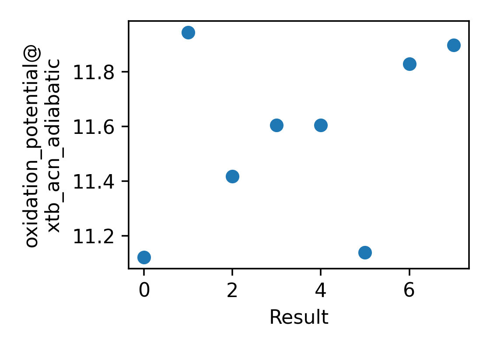

# Run Report
Report time: 2023-10-18 16:00:07.600356

## Task Summary
Measures how many tasks have run as part of the application

| Task Type   |   Count |   Node Hours | Failures   |
|-------------|---------|--------------|------------|
| simulation  |       2 |      0.00098 | 0 (0.0%)   |

## Outcomes over Time
The property of the molecules over time.

